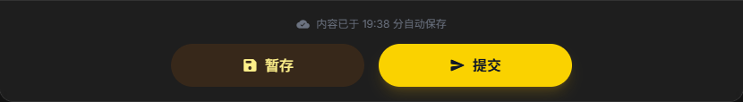
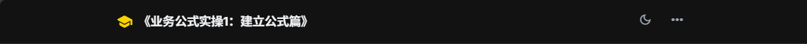
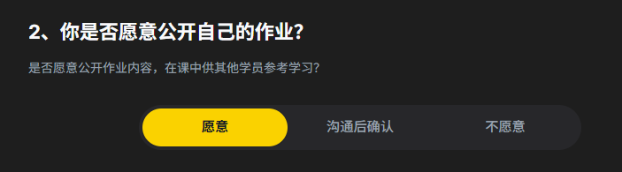

查看html中具有哪些接口，我当前只能看到前端内容，请帮我罗列出前端与后端进行对接的接口，并注释这些接口的作用。

在新一版的html页面中，需要保留这些接口。

---
## 项目todo情况

- [X] 图片缩放功能

# 优化需求 

1. 底部“暂存”按钮取消：，按钮移动替代顶栏最右边的三个点 ，用一个保存图标表示暂存功能，其功能接口与原来的暂存接口一致（如果在这般中没有找到暂存功能接口，则参考 @Ref\HW未填写版本.html 中的暂存接口）。
2. 课程反馈2中，默认选中"愿意”滑块，如图：
3. 输入框菜单栏最右按钮》全屏状态下，右上角保留顶栏内容：

最后剩下的就是说明板块的排版了。